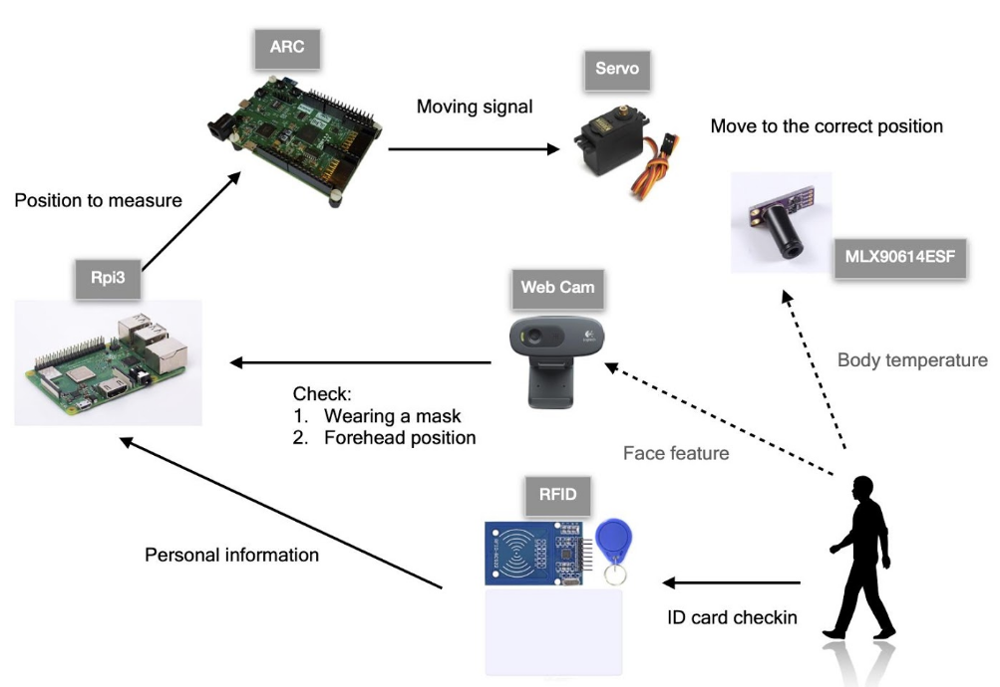

# ArcIoT-Automatic body tracking thermometer

## Introduction
Automatic body tracking thermometer (ABTT) is a low-cost epidemic prevention auxiliary device based on ARCIoT board.
Initiatively detect and tracking human body and measure its body temperature.



## Table of Contents
- [ArcIoT-Automatic body tracking thermometer](#arciot-automatic-body-tracking-thermometer)
  - [Introduction](#introduction)
  - [Table of Contents](#table-of-contents)
  - [HW/SW Setup](#hwsw-setup)
    - [Hardware design](#hardware-design)
      - [Connections](#connections)
    - [Software design](#software-design)
  - [User Manual](#user-manual)
  - [References](#references)

## HW/SW Setup

We use webcam and infrared grid sensor to get human body temperature by image recognition.
The webcam captures image of people who pass the detection region of ABTT. With the accompany IR grid sensor, we can get the body temperature. 

### Hardware design

- ARC IoTDK board
- Raspberry Pi
- AMG8833 IR grid sensor
- Webcam
- 2004 I2C LCD

The conmmunication between IoTDK and Raspberry Pi is `UART`

#### Connections
```
AMG8833         IoTDK
SCL     <->    I2C0_SCL
SDA     <->    I2C0_SDA

     cIoTDK              Raspberry Pi
GPIO 14 (TXD)  <->  UART2_CTS
GPIO 15 (RXD)  <->  UART2_TXD

```

### Software design

We use face detection program running on Raspberry to capture frames from the webcam. Once it finds a face in a frame, it will send out the coordinate of the face to IoTDK via UART. 

## User Manual

Compiling face-detection program

```bash
cd rpi/face-detect_cpp
make
./main
```


## References
[OpenCV-Face-Recognition](https://github.com/Mjrovai/OpenCV-Face-Recognition)
[Face-detection-Raspberry-Pi-32-64-bits](https://github.com/Qengineering/Face-detection-Raspberry-Pi-32-64-bits)
[Infrared Array Sensor Grid-EYE](https://cdn.sparkfun.com/assets/4/1/c/0/1/Grid-EYE_Datasheet.pdf)